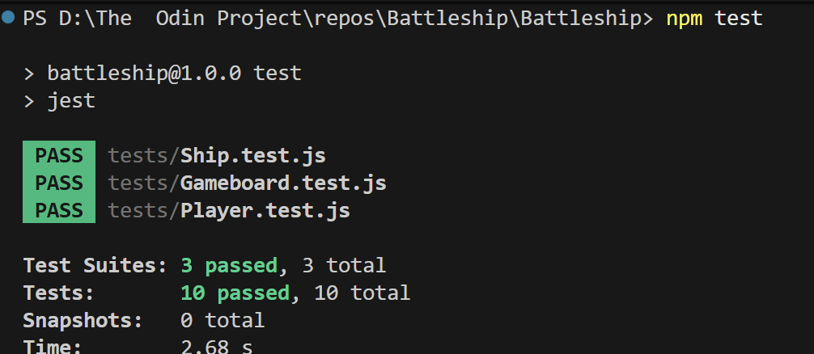

# Battleship Game

A classic Battleship game built with Test-Driven Development as part of The Odin Project JavaScript Course.

## What I Learned

- Test-Driven Development with Jest
- Object-Oriented Programming (Ship, Gameboard, Player classes)
- DOM manipulation and event handling (drag and drop)
- Smart AI algorithms (adjacent cell targeting after hits)
- Game state management for turn-based gameplay
- Separation of concerns (game logic vs UI)

## Features

- Drag and drop ship placement with rotation
- VS Computer mode with intelligent AI
- Two player local multiplayer
- Visual feedback for gameplay

## Tech Stack

JavaScript ES6, HTML5, CSS3, Jest, Babel

## Usage

```bash
npm install
npm test          # Run tests
npm run dev       # Play the game
```

Or open `index.html` directly in a browser.

## Test Results



---

Project from [The Odin Project](https://www.theodinproject.com/)
